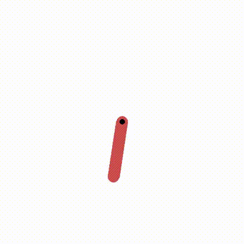

# Pendulum Reward Shaping

A hands-on RL project: implementing PPO from scratch on Gymnasium's `Pendulum-v1`, then experimenting with custom reward wrappers to teach non-trivial behaviors through reward design alone.

## Demo

Agent trained to balance 30° off vertical (custom reward wrapper):

<>

## What I Built

- **PPO from scratch** — actor-critic network, rollout buffer, GAE, clipped objective, multiple update epochs. No RL libraries used.
- **Custom reward wrappers** — using Gymnasium's wrapper pattern to shape rewards and teach the agent different target behaviors.
- **Training + eval pipeline** — model checkpointing, deterministic evaluation, video recording.

## What I Learned

- How policy gradients work and why vanilla REINFORCE is unstable without the PPO clip
- How GAE blends bias/variance in advantage estimates (γ and λ)
- Why PPO reuses rollout data across K update epochs safely (clipping keeps the policy close to the one that collected the data)
- How fragile reward design is — small changes to the reward produce surprisingly different policies
- Gymnasium's wrapper pattern and the env API internals

## Project Structure

```
src/
  agent.py       # Actor-Critic network (Gaussian policy + value head)
  ppo.py         # PPO: rollout, GAE, clipped update, training loop
  wrappers.py    # Custom reward wrappers (AngleBalanceWrapper)
main.py          # Train entry point
eval.py          # Load a checkpoint and render the trained agent
```

## Setup

```bash
uv sync
```

## Train

```bash
uv run python main.py
```

Saves the trained policy to `agent.pt`.

## Eval

```bash
uv run python eval.py
```

Loads `agent.pt` and runs the policy with rendering.

## Results

Standard Pendulum (upright balance): mean episode reward climbed from ~-1500 (random) to ~-160 (close to optimal of ~-100) in ~500 iterations on CPU.

## Next Up

More reward variants from the original plan:

- N rotations before stopping upright
- Minimize energy while balancing
- Alternate swing directions every 5 seconds
